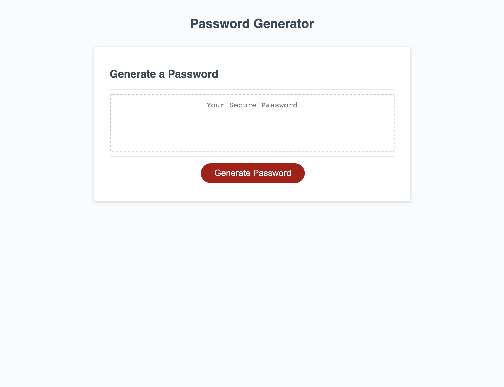
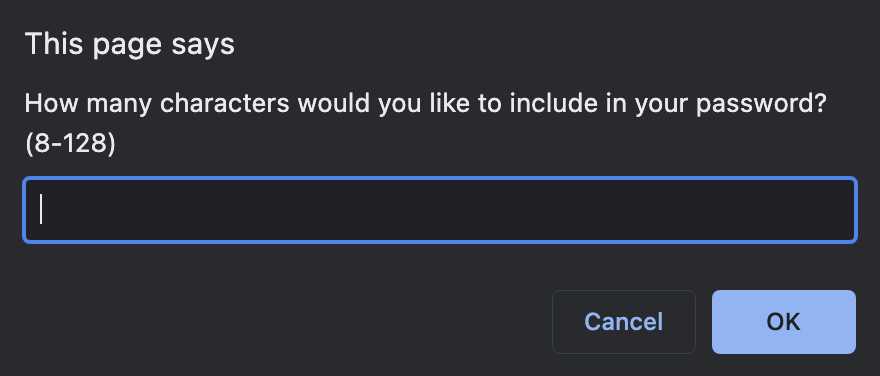
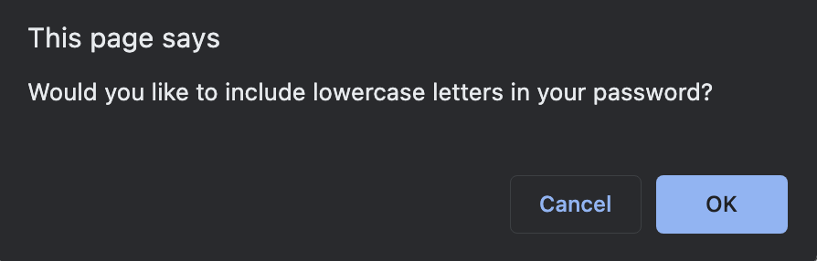
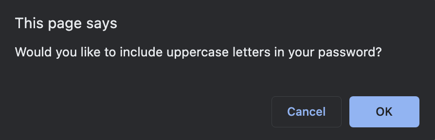
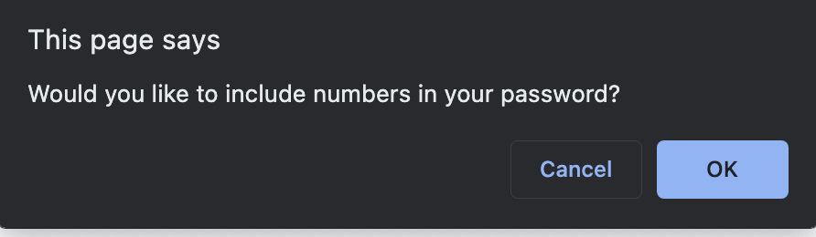
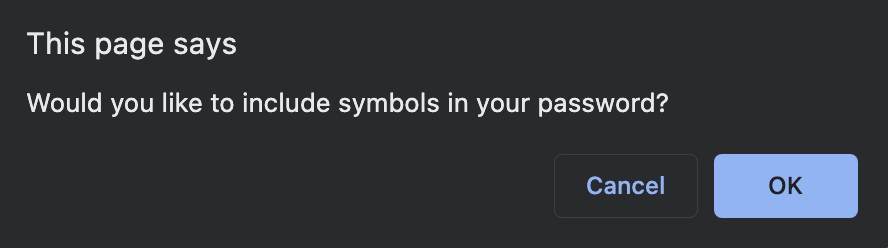

# The Great Randomizer

The Great Randomizer is a password generator that generates passwords between 8 and 128 characters and allows for several character types to be included based on the users inputs.

## Using The Great Randomizer

Click on the "Generate Password" button and answer the prompts that appear.

## Technologies

* HTML
* CSS
* Javascript

## Maintainers

* Brandon Henry
